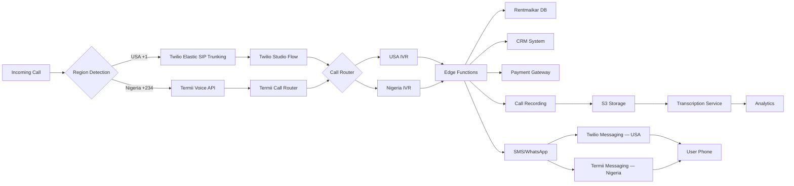

# Rentmaikar Call Infrastructure Architecture - Reference

> [!WARNING]
> **SUPERSEDED / REFERENCE ARCHITECTURE — NON-AUTHORITATIVE FOR RUNTIME COMMUNICATIONS & AUTH**
> This reference diagram reflects early blueprint concepts. In production:
> - OTP is strictly unified under `OtpService` & `SENT.dm` via `MessagingBridge` (Phase 15).
> - Provider routing and preservation adhere to `docs/architecture/PLATFORM_PROVIDER_PRESERVATION.md` and `docs/architecture/ROUTING_BRIDGE_ADAPTER_ARCHITECTURE.md`.
> - Authoritative rules are specified in `docs/architecture/DOCUMENTATION_AUTHORITY_AND_AI_STUDIO_GUARDRAILS.md`.

## Provider Stack

| Component | USA | Nigeria |
|---|---|---|
| **Voice Calls** | Twilio Voice API | Termii Voice API |
| **SMS** | Twilio SMS | Termii SMS |
| **WhatsApp** | Twilio WhatsApp | Termii WhatsApp |
| **OTP** | Twilio Verify | Termii Token |
| **Payments** | PayPal | Paystack |
